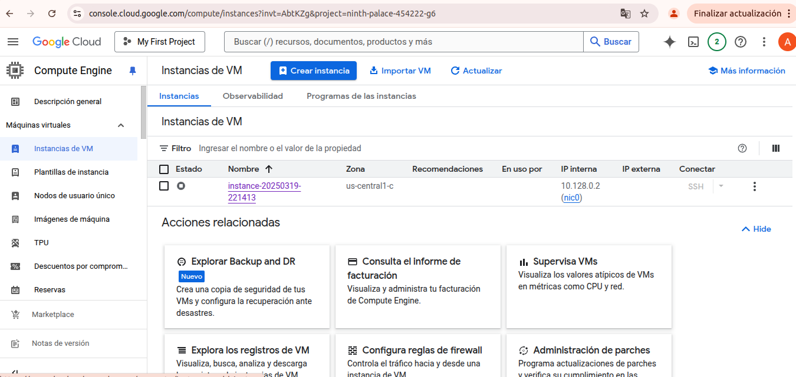
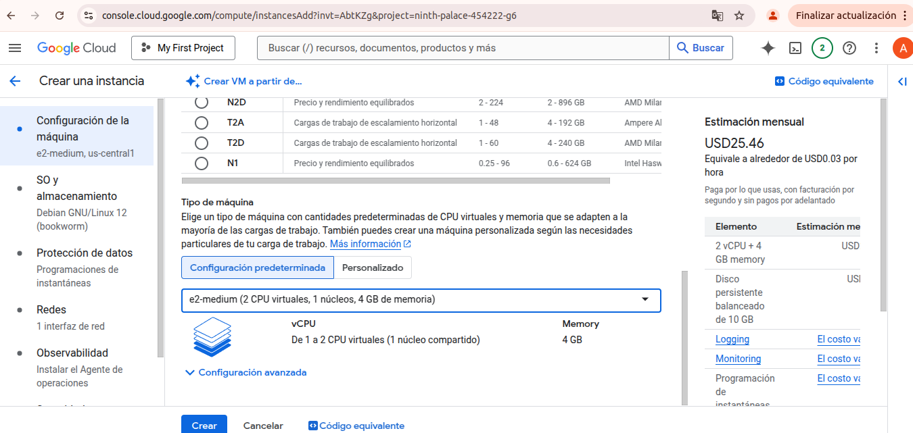

# 🖥️ Paso a paso creación de máquina virtual en Google Cloud

## 🔧 Creación de la VM

1. Tener una cuenta activa en Google Cloud.

2. Crear un proyecto nuevo o acceder a uno existente.

3. Acceder a **Compute Engine**.

4. Ir a **Instancias de VM**.

5. Crear una nueva instancia.

6. Seleccionar la región del servidor.

7. Seleccionar el tipo de máquina: **E2-medium**.

8. Configurar las características de la máquina.

9. Seleccionar el sistema operativo y el almacenamiento del disco.

10. Configurar la red.


---

## 🧪 Código equivalente (CLI)

```bash
gcloud compute instances create instance-20250327-155515   --project=ninth-palace-454222-g6   --zone=us-central1-c   --machine-type=e2-medium   --network-interface=network-tier=PREMIUM,stack-type=IPV4_ONLY,subnet=default   --metadata=enable-osconfig=TRUE   --maintenance-policy=MIGRATE   --provisioning-model=STANDARD   --service-account=133144703501-compute@developer.gserviceaccount.com   --scopes=https://www.googleapis.com/auth/devstorage.read_only,https://www.googleapis.com/auth/logging.write,https://www.googleapis.com/auth/monitoring.write,https://www.googleapis.com/auth/service.management.readonly,https://www.googleapis.com/auth/servicecontrol,https://www.googleapis.com/auth/trace.append   --tags=http-server,https-server   --create-disk=auto-delete=yes,boot=yes,device-name=instance-20250327-155515,image=projects/ubuntu-os-cloud/global/images/ubuntu-2204-jammy-v20250312,mode=rw,size=10,type=pd-balanced   --no-shielded-secure-boot   --shielded-vtpm   --shielded-integrity-monitoring   --labels=goog-ops-agent-policy=v2-x86-template-1-4-0,goog-ec-src=vm_add-gcloud   --reservation-affinity=any &&

printf 'agentsRule:\n  packageState: installed\n  version: latest\ninstanceFilter:\n  inclusionLabels:\n  - labels:\n      goog-ops-agent-policy: v2-x86-template-1-4-0\n' > config.yaml &&

gcloud compute instances ops-agents policies create goog-ops-agent-v2-x86-template-1-4-0-us-central1-c   --project=ninth-palace-454222-g6   --zone=us-central1-c   --file=config.yaml &&

gcloud compute resource-policies create snapshot-schedule default-schedule-1   --project=ninth-palace-454222-g6   --region=us-central1   --max-retention-days=14   --on-source-disk-delete=keep-auto-snapshots   --daily-schedule   --start-time=13:00 &&

gcloud compute disks add-resource-policies instance-20250327-155515   --project=ninth-palace-454222-g6   --zone=us-central1-c   --resource-policies=projects/ninth-palace-454222-g6/regions/us-central1/resourcePolicies/default-schedule-1
```

---

## ✅ Verificación

- La VM se crea correctamente.

- Se puede acceder a través del botón **SSH** desde la consola de Google Cloud.


---

# 🚀 Despliegue de la solución `SmartCampus`

## 1. Subir `.zip` desde la PC

```bash
ls -lh ~/Documentos/Universidad/Proyecto\ de\ grado/Implementacion/SmartCampus.zip
```

## 2. Configurar proyecto activo

```bash
gcloud config set project ninth-palace-454222-g6
```

## 3. Subir archivo a la VM

```bash
gcloud compute scp SmartCampus.zip instance-20250327-155515:~ --zone=us-central1-c
```

## 4. Conectarse a la VM

```bash
gcloud compute ssh instance-20250327-155515 --zone=us-central1-c
```

## 5. Extraer el archivo `.zip`

```bash
sudo apt update
sudo apt install unzip -y
unzip SmartCampus.zip -d SmartCampus
cd SmartCampus
ls -la
```

## 6. Instalar Docker

```bash
sudo apt install docker.io -y
sudo usermod -aG docker $USER
newgrp docker
```

## 7. Instalar Docker Compose

```bash
sudo curl -L "https://github.com/docker/compose/releases/download/v2.24.5/docker-compose-$(uname -s)-$(uname -m)" -o /usr/local/bin/docker-compose
sudo chmod +x /usr/local/bin/docker-compose
docker-compose --version
```

## 8. Desplegar los servicios

```bash
cd ~/SmartCampus
docker-compose up -d
```

## 9. Obtener IP pública de la VM

```bash
gcloud compute instances describe instance-20250327-155515 --zone=us-central1-c --format="get(networkInterfaces[0].accessConfigs[0].natIP)"
```

## 10. Abrir puertos en el firewall

```bash
gcloud compute firewall-rules create allow-custom-ports   --allow tcp:1880,tcp:3000,tcp:8086,tcp:18083   --target-tags=http-server   --description="Permitir acceso a servicios Docker en puertos personalizados"   --direction=INGRESS   --priority=1000   --network=default
```

## 11. Acceder desde el navegador

Con la IP pública `34.66.66.21`, puedes acceder a:

- Node-RED: http://34.66.66.21:1880
- Grafana: http://34.66.66.21:3000
- InfluxDB: http://34.66.66.21:8086
- EMQX Dashboard: http://34.66.66.21:18083

---

# 🔐 Credenciales por defecto

| Servicio   | Usuario | Contraseña |
|------------|---------|------------|
| **Grafana** | admin   | admin      |
| **Node-RED** | (sin auth por defecto) | — |
| **InfluxDB 2** | Configurable en docker-compose o UI |
| **EMQX**     | admin   | public     |		
