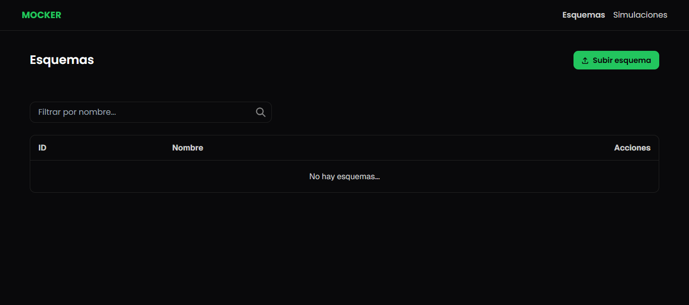
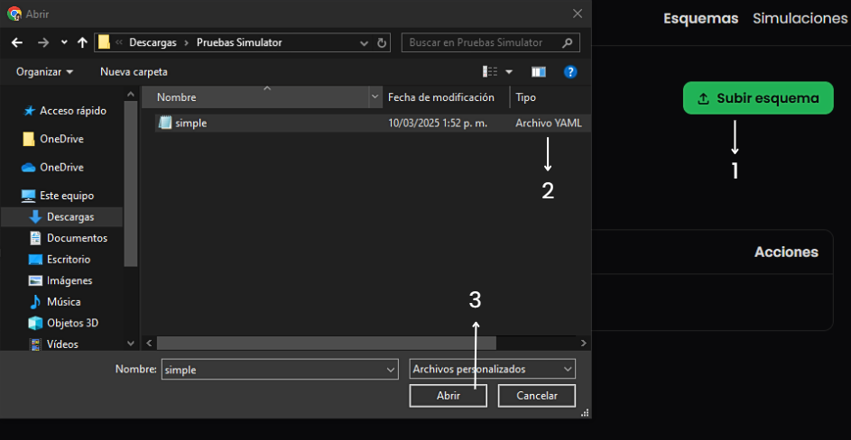
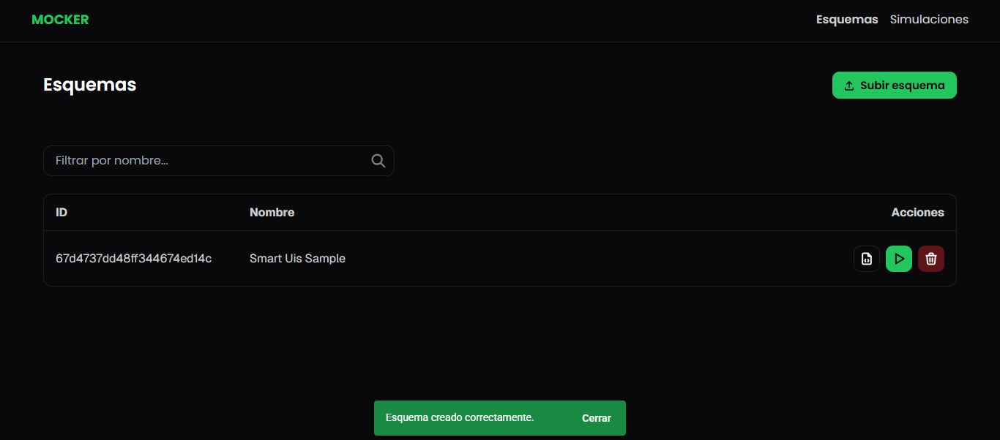
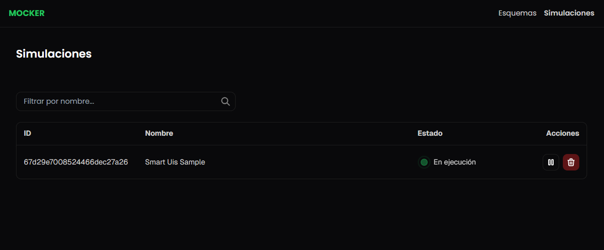
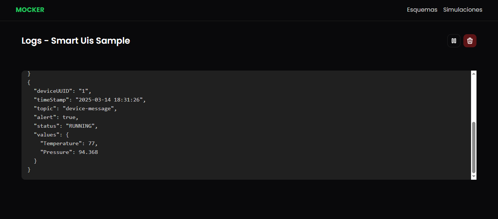

#Simulaciones

Una solución diseñada para facilitar la generación, emulación y transmisión de datos sintéticos desde sensores virtuales, ideal para pruebas, validación de sistemas IoT y desarrollo de aplicaciones basadas en eventos.

Este software nace con el objetivo de replicar de manera flexible y precisa el comportamiento de sensores reales dentro de entornos controlados, permitiendo a desarrolladores, investigadores y equipos técnicos simular escenarios complejos sin necesidad de desplegar hardware físico. A través de archivos YAML altamente configurables, es posible definir con exactitud las características de cada simulación, incluyendo:

- Protocolos de comunicación como MQTT y AMQP, para enviar datos simulados a servidores, aplicaciones o plataformas de monitoreo.
- Estrategias de muestreo para controlar la frecuencia, los ciclos y los patrones temporales de generación de datos.
- Generadores de datos personalizados que permiten modelar distintos tipos de información, desde valores numéricos hasta fechas, textos y estados booleanos.

##¿Para qué sirve este simulador?
- **Pruebas de integración:** Simula sensores antes de instalar dispositivos físicos para verificar la comunicación, procesamiento y almacenamiento de datos en sistemas productivos.
- **Desarrollo ágil:** Facilita a los equipos de software la validación de funcionalidades dependientes de entradas sensorizadas sin demoras por disponibilidad de hardware.
- **Investigación y docencia:** Permite a investigadores y estudiantes modelar comportamientos complejos de redes de sensores y evaluar resultados de manera controlada.
- **Escenarios extremos:** Genera patrones anormales o de alta carga para validar la tolerancia y respuesta de sistemas ante situaciones críticas.

##¿Cómo funciona?

El simulador se basa en una configuración YAML que describe detalladamente cada componente de la simulación:
<table>
  <tr>
    <th>Componente</th>
    <th>Descripción</th>
  </tr>
  <tr>
    <td>name</td>
    <td>Identifica la simulación de manera única</td>
  </tr>
  <tr>
    <td>protocols</td>
    <td>Define cómo se envían los datos generados, especificando el tipo de protocolo y sus parámetros</td>
  </tr>
  <tr>
    <td>sampler</td>
    <td>Controla la temporalidad del flujo de datos mediante estrategias y pasos configurables</td>
  </tr>
  <tr>
    <td>generators</td>
    <td>Generan los valores de cada dato simulado, pudiendo ser números aleatorios, fechas, textos, secuencias o estados booleanos.</td>
  </tr>
</table>

## Documentación Mocker API

---

### Endpoints

---

#### Schemas (`/api/v1/schema`)

##### Obtener lista de schemas
**GET** `/api/v1/schema`  
**Respuesta 200**: Lista de schemas detallados.

---

##### Obtener lista corta de schemas  
**GET** `/api/v1/schema/short`  
**Respuesta 200**:
```json
[
  {
    "id": "67c9c972a0286832b837ad58",
    "name": "Test",
    "status": true
  }
]
```

---

##### Obtener lista corta de schemas en stream  
**GET** `/api/v1/schema/short/stream?interval=<integer>`  
**Headers**:  
`Accept: text/event-stream`

---

##### Obtener schema por ID  
**GET** `/api/v1/schema/:id`  
**Path Param**:  
- `id` (`string`, requerido)

---

##### Crear schema  
**POST** `/api/v1/schema`  
**Body (JSON)**:
```json
{
  "name": "Test",
  "protocols": [
    {
      "type": "mqtt",
      "host": "localhost",
      "port": 1883,
      "topic": "device-messages",
      "clientId": "mocker-client",
      "username": "user",
      "password": "password"
    }
  ],
  "sampler": {
    "type": "sequential",
    "steps": [
      {
        "type": "loop",
        "delay": 2500
      }
    ]
  },
  "generators": [
    {
      "type": "timestamp",
      "name": "TimestampGenerator"
    },
    {
      "type": "boolean",
      "name": "BooleanGenerator",
      "probability": 0.5
    },
    {
      "type": "random_integer",
      "name": "RandomInteger",
      "min": 25,
      "max": 30
    },
    {
      "type": "random_double",
      "name": "RandomDouble",
      "min": 50,
      "max": 70,
      "decimals": 2
    }
  ]
}
```

---

##### Actualizar template de schema  
**PUT** `/api/v1/schema/template/:id`  
**Body (JSON)**:
```json
{
  "deviceUUID": "1",
  "timeStamp": "{{TimestampGenerator}}",
  "topic": "device-message",
  "alert": {{BooleanGenerator}},
  "status": "OK",
  "values": {
    "Temperature": {{RandomInteger}},
    "Pressure": {{RandomDouble}}
  }
}
```

---

##### Eliminar schema  
**DELETE** `/api/v1/schema/:id`

---

#### Simulations (`/api/v1/simulation`)

##### Obtener todas las simulaciones  
**GET** `/api/v1/simulation`

---

##### Obtener estado de simulación  
**GET** `/api/v1/simulation/state/:id`

---

##### Iniciar simulación  
**GET** `/api/v1/simulation/start/:id`

---

##### Detener simulación  
**GET** `/api/v1/simulation/stop/:id`

---

##### Terminar simulación (kill)  
**GET** `/api/v1/simulation/kill/:id`

---

##### Logs de simulación en stream  
**GET** `/api/v1/simulation/logs/:id?interval=<integer>`  
**Headers**:  
`Accept: text/event-stream`

---

##### Stream de simulaciones  
**GET** `/api/v1/simulation/stream?interval=<integer>`  
**Headers**:  
`Accept: text/event-stream`

---

### Códigos de respuesta comunes

| Código | Descripción              |
|--------|--------------------------|
| 200    | OK                       |
| 400    | Bad Request              |
| 500    | Internal Server Error    |

---

### Notas adicionales

- Para los endpoints tipo **stream**, asegúrate de manejar correctamente los eventos **SSE (Server-Sent Events)**.
- Los valores `<string>`, `<integer>`, etc., deben ser reemplazados por datos reales según el contexto de uso.

## Documentación Mocker CLI


---

### Introducción

Mocker CLI es una herramienta de línea de comandos diseñada para la gestión de simulaciones y esquemas. Permite administrar simulaciones y definir esquemas de datos de manera sencilla y eficiente.

---

### Configuración por Sistema Operativo

#### Windows

**CMD:**
```cmd
set MOCKER_HOST=localhost
set MOCKER_PORT=8090
```

**PowerShell:**
```powershell
$env:MOCKER_HOST="localhost"
$env:MOCKER_PORT="8090"
```

#### Linux y macOS
```bash
export MOCKER_HOST=localhost
export MOCKER_PORT=8090
```

---

### Verificación

Para verificar la instalación de Mocker CLI, ejecute el siguiente comando:

```bash
mocker --version
```

**Output:**
```
 _____         _
|     |___ ___| |_ ___ ___
| | | | . |  _| '_| -_|  _|
|_|_|_|___|___|_,_|___|_| v0.12.0
```

---

### Uso

La herramienta proporciona las siguientes opciones y comandos:

```bash
Usage: mocker [-hV] [COMMAND]
Mocker CLI tool
  -h, --help      Show this help message and exit.
  -V, --version   Print version information and exit.
Commands:
  simulation, sim  Manage simulations.
  schema, s        Manage schemas.
```

---

### Opciones Globales

- `-h`, `--help` → Muestra la ayuda de la herramienta y finaliza la ejecución.
- `-V`, `--version` → Muestra la versión actual de Mocker CLI.

---

### Comandos

#### `schema`, `s`

Administra los esquemas de datos utilizados en las simulaciones.

```bash
Usage: mocker schema [-hV] [COMMAND]
Manage schemas.
  -h, --help      Show this help message and exit.
  -V, --version   Print version information and exit.
Commands:
  create, c    Create a new schema.
  list, ls     List all schemas.
  delete, d    Delete a schema.
  template, t  Set the schema template.
```

##### `schema create`

Crea un nuevo esquema a partir de un archivo YAML.

```bash
Usage: mocker schema create [-hV] -f=<path>
  -f, --file=<path>   Path to the YAML file.
  -h, --help          Show this help message and exit.
  -V, --version       Print version information and exit.
```

**Ejemplo:**
```bash
mocker schema create --file schema.yaml
```

##### `schema list`

Lista todos los esquemas disponibles.

```bash
Usage: mocker schema list [-hV]
```

**Ejemplo:**
```bash
mocker schema list
```

##### `schema delete`

Elimina un esquema especificado por su ID.

```bash
Usage: mocker schema delete [-hV] -i=<id>
  -i, --id=<id>   Schema ID.
```

**Ejemplo:**
```bash
mocker schema delete --id <schemaId>
```

##### `schema template`

Establece una plantilla de esquema desde un archivo de texto.

```bash
Usage: mocker schema template [-hV] -f=<path> -i=<id>
  -f, --file=<path>   Path to the template file.
  -i, --id=<id>       Schema ID.
```

**Ejemplo:**
```bash
mocker schema template --file template.txt --id <schemaId>
```

---

#### `simulation`, `sim`

Administra las simulaciones en la herramienta.

```bash
Usage: mocker simulation [-hV] [COMMAND]
Commands:
  create, c   Create a new simulation.
  list, ls    List all simulations.
  start, run  Start a simulation.
  stop        Stop a simulation.
  kill, k     Kill a simulation.
```

##### `simulation create`

Crea una nueva simulación basada en un esquema existente.

```bash
Usage: mocker simulation create [-hV] -i=<id>
```

**Ejemplo:**
```bash
mocker simulation create --id <schemaId>
```

##### `simulation list`

Lista todas las simulaciones disponibles.

```bash
Usage: mocker simulation list [-hV]
```

**Ejemplo:**
```bash
mocker simulation list
```

##### `simulation start`

Inicia una simulación específica.

```bash
Usage: mocker simulation start [-hV] -i=<id>
```

**Ejemplo:**
```bash
mocker simulation start --id <schemaId>
```

##### `simulation stop`

Detiene una simulación en ejecución.

```bash
Usage: mocker simulation stop [-hV] -i=<id>
```

**Ejemplo:**
```bash
mocker simulation stop --id <schemaId>
```

##### `simulation kill`

Finaliza inmediatamente una simulación en ejecución.

```bash
Usage: mocker simulation kill [-hV] -i=<id>
```

**Ejemplo:**
```bash
mocker simulation kill --id <schemaId>
```

---

### Ejemplos de Uso

- Crear un schema  
  ```bash
  mocker schema create --file schema.yaml
  ```

- Definir una plantilla de esquema  
  ```bash
  mocker schema template --file template.txt --id <schemaId>
  ```

- Crear una simulación  
  ```bash
  mocker simulation create --id <schemaId>
  ```

- Listar todas las simulaciones  
  ```bash
  mocker simulation list
  ```

- Ejecutar una simulación  
  ```bash
  mocker simulation start --id <simulationId>
  ```

- Detener una simulación  
  ```bash
  mocker simulation stop --id <simulationId>
  ```

- Eliminar una simulación  
  ```bash
  mocker simulation kill --id <simulationId>
  ```
  
## Documentación Mocker DSL
---

### Introducción

Este documento describe el DSL (Domain Specific Language) utilizado para crear simulaciones. El DSL está basado en YAML y permite definir protocolos, generadores de datos y muestreadores para simular diferentes escenarios.

---

### Estructura del Archivo YAML

```yaml
name: <Nombre de la simulación>

protocols:
  - type: <mqtt/amqp>
    ...configuración específica...

sampler:
  type: sequential
  steps:
    - type: <step/burst/delay/...>
      ...parámetros...

generators:
  - type: <timestamp/boolean/random_integer/...>
    name: <Nombre del generador>
    ...parámetros...
```

---

### 1. Protocolos

Los protocolos definen cómo se enviarán los datos generados. Actualmente, se soportan dos tipos de protocolos: MQTT y AMQP.

#### MQTT

| Parámetro  | Descripción                          | Ejemplo              |
|------------|--------------------------------------|----------------------|
| type       | Tipo de protocolo (mqtt)             | mqtt                 |
| host       | Dirección del servidor MQTT          | localhost            |
| port       | Puerto del servidor MQTT             | 1883                 |
| topic      | Tema MQTT al que se enviarán mensajes| device-messages      |
| clientId   | Identificador del cliente MQTT       | mocker-client-1      |
| username   | Nombre de usuario para autenticación | user                 |
| password   | Contraseña para autenticación        | password             |

#### AMQP

| Parámetro   | Descripción                                | Ejemplo              |
|-------------|--------------------------------------------|----------------------|
| type        | Tipo de protocolo (amqp)                   | amqp                 |
| host        | Dirección del servidor AMQP                | localhost            |
| port        | Puerto del servidor AMQP                   | 5672                 |
| username    | Nombre de usuario para autenticación       | guest                |
| password    | Contraseña para autenticación              | guest                |
| exchange    | Nombre del exchange AMQP                   | simulation_exchange  |
| routingKey  | Clave de enrutamiento para los mensajes    | simulation.key       |

---

### 2. Sampler (Muestreador)

El muestreador define cómo se generarán y enviarán los datos. Puede ser de tipo `sequential` y contiene una lista de pasos que se ejecutarán en orden.

#### Tipos de Pasos

| Tipo            | Parámetros                             | Descripción                                         | Ejemplo                              |
|-----------------|-----------------------------------------|-----------------------------------------------------|--------------------------------------|
| step            | duration, interval                      | Paso con duración e intervalo                      | duration: 10000, interval: 1000      |
| burst           | delay, size                             | Grupo de mensajes en ráfaga                         | delay: 100, size: 10                 |
| delay           | delay                                   | Retardo antes de continuar                         | delay: 500                           |
| count           | delay, count                            | Envío de mensajes contados                         | delay: 200, count: 20                |
| random          | min, max                                | Retardo aleatorio entre mensajes                   | min: 100, max: 1000                  |
| loop            | delay                                   | Repetición infinita del paso anterior              | delay: 300                           |
| pulse           | pulse, idle                             | Pulsos de mensajes                                 | pulse: 5000, idle: 100               |
| traffic-spike   | normal, spike, duration                  | Simulación de picos de tráfico                     | normal: 10000, spike: 100, duration: 50000 |
| window          | active, inactive, interval              | Ventana de actividad e inactividad                 | active: 1000, inactive: 5000, interval: 200 |

---

### 3. Generadores

Los generadores definen cómo se crearán los datos enviados.

#### Tipos de Generadores (Resumen)

- `timestamp`: Marca de tiempo
- `boolean`: Valor booleano
- `random_integer`: Entero aleatorio
- `random_double`: Decimal aleatorio
- `continuous_*`: Distribuciones continuas (normal, exponencial, etc.)
- `discrete_*`: Distribuciones discretas (binomial, geométrica, etc.)
- `string`: Generación de texto

(Ver archivo completo para ejemplos detallados por tipo)

---

### Configuración YAML - MQTT

```yaml
protocols:
  - type: mqtt
    host: mqtt.example.com
    port: 1883
    topic: iot/sensors
    clientId: sensor-client
    username: user
    password: password
```

---

### Configuración YAML - AMQP

```yaml
protocols:
  - type: amqp
    host: amqp.example.com
    port: 5672
    username: guest
    password: guest
    exchange: orders
    routingKey: order.created
```

---

### Casos de Uso para Samplers y Generators

(Se listan con YAML en ejemplos completos en el archivo)

- `step`: envío cada 5s por 1 min
- `burst`: 10 mensajes cada 100ms
- `delay`: pausa de 5s
- `count`: 20 mensajes con 200ms
- `random`: 100ms a 1000ms aleatorio
- `loop`: envío cada 300ms continuo
- `pulse`: pulso de 5s, inactivo 100ms
- `traffic-spike`: tráfico denso por 30s
- `window`: ciclos activos/inactivos

Y para generadores:

- `boolean`: probabilidad de alerta
- `random_integer`: conteo aleatorio
- `random_double`: temperatura decimal
- `continuous_*`: distribuciones estadísticas
- `string`: selección ponderada de texto

## Documentación Mocker WEB
---

### 📌 Guía de Uso

Esta sección detalla las instrucciones básicas para utilizar **MOCKER WEB**.

---

### 🖥️ Vista de Esquemas

#### 1️⃣ Acceder a la Vista de Esquemas

Dirígete a la sección **Esquemas**.  
Si no se ha cargado ningún esquema, la tabla mostrará el mensaje:

> “No hay esquemas...”

---

#### 2️⃣ Subir un Esquema

Pasos:

1. Presiona el botón **Subir esquema**.
2. Selecciona el archivo `.yaml` que define la simulación.
3. Haz clic en **Abrir** para cargar el archivo.

---

#### 3️⃣ Visualizar el Nuevo Esquema

Una vez confirmada la carga, la aplicación notificará que el esquema se ha cargado correctamente y se mostrará en la tabla junto con su **ID** y **Nombre**.



---

#### ⚠️ Recomendación: Subir un Template

Después de subir un esquema, se recomienda cargar un **template** (archivo `.txt`).  
Aunque opcional, este ayuda a definir cómo se presentarán los logs de la simulación, mejorando su claridad y organización.

- Presiona el botón **Subir Template** y selecciona el archivo correspondiente.

---

#### ✅ Acciones Disponibles

| Acción           | Descripción                                                              |
|------------------|---------------------------------------------------------------------------|
| Subir Template   | Permite subir un archivo `.txt` para mostrar los logs.                   |
| Iniciar Simulación | Inicia la simulación (el botón desaparecerá una vez activa).            |
| Eliminar Esquema | Elimina el esquema de la lista.                                          |

---

#### 4️⃣ Navegar a la Vista de Simulaciones

Tras iniciar una simulación, accede a la sección **Simulaciones** para supervisar el proceso en tiempo real.

---

### 📊 Vista de Simulaciones

Esta vista muestra todas las simulaciones derivadas de los esquemas cargados.  
Cada simulación incluye:

- **ID y Nombre**: Para correlación con el esquema original.
- **Estado**: Puede ser “En Ejecución” o “Suspendido”.

---

#### 🚀 Acciones Disponibles

| Acción             | Descripción                                                         |
|--------------------|---------------------------------------------------------------------|
| Iniciar Simulación | Inicia la simulación. Luego aparece opción para pausar.            |
| Pausar Simulación  | Suspende temporalmente la simulación.                              |
| Eliminar Simulación| Elimina la simulación de la lista.                                 |

---

#### 5️⃣ Acceder a los Logs

Haz clic en el **ID**, **nombre** o **estado** de una simulación (cualquier parte de la fila excepto las acciones) para ver los **logs detallados**.

---

### 📜 Vista de Logs

Permite acceso en **tiempo real** a los registros de la simulación.  
También puedes **pausar**, **iniciar** o **eliminar** la simulación desde esta vista.

---

### 📝 Notas Importantes

#### 🔄 Persistencia de Simulaciones

- Si eliminas un esquema desde la vista de Esquemas, desaparecerá allí.
- **Pero** la simulación seguirá activa y visible en la vista de Simulaciones.

#### ⚠️ Relación entre Esquemas y Simulaciones

- Si eliminas una simulación desde la vista de Simulaciones, puedes volver a ejecutarla desde Esquemas.
- **Siempre que el esquema original no haya sido eliminado.**

#### 🛠️ Consejo de Gestión

Para un control estricto:

- Elimina tanto el **esquema** como la **simulación** asociada.
- Así evitas confusiones durante el monitoreo del sistema.

## Ejemplo de Configuración para Smart Campus UIS


---

Este es un ejemplo de configuración en YAML para la simulación de sensores en la plataforma **Smart Campus UIS**.

---

### 📄 Archivo YAML de Configuración

```yaml
name: Smart UIS Sample

protocols:
  - type: mqtt
    host: mosquitto
    port: 1883
    topic: device-messages
    clientId: mocker-client-1
    username: user
    password: password

sampler:
  type: loop
  delay: 1000

generators:

  - type: timestamp
    name: TimestampGenerator

  - type: boolean
    name: BooleanGenerator
    probability: 0.5

  - type: random_integer
    name: RandomInteger
    min: 10
    max: 100

  - type: random_double
    name: RandomDouble
    min: 10
    max: 100
    decimals: 3

  - type: string
    name: StringWeightedGenerator
    sampling: weighted
    values:
      - RUNNING
      - IDLE
      - STOPPED
    weights:
      - 0.8
      - 0.1
      - 0.1
```

---

### 📄 Ejemplo de Template `.txt`

Este es un ejemplo de configuración del **template** para la simulación de sensores en la plataforma Smart UIS.

```json
{
    "deviceUUID": "1",
    "timeStamp": "{{TimestampGenerator}}",
    "topic": "device-message",
    "alert": {{BooleanGenerator}},
    "status": "{{StringWeightedGenerator}}",
    "values": {
        "Temperature": {{RandomInteger}},
        "Pressure": {{RandomDouble}}
    }
}
```

---

Este JSON representa un mensaje de ejemplo generado a partir de los valores simulados definidos en la configuración YAML.


